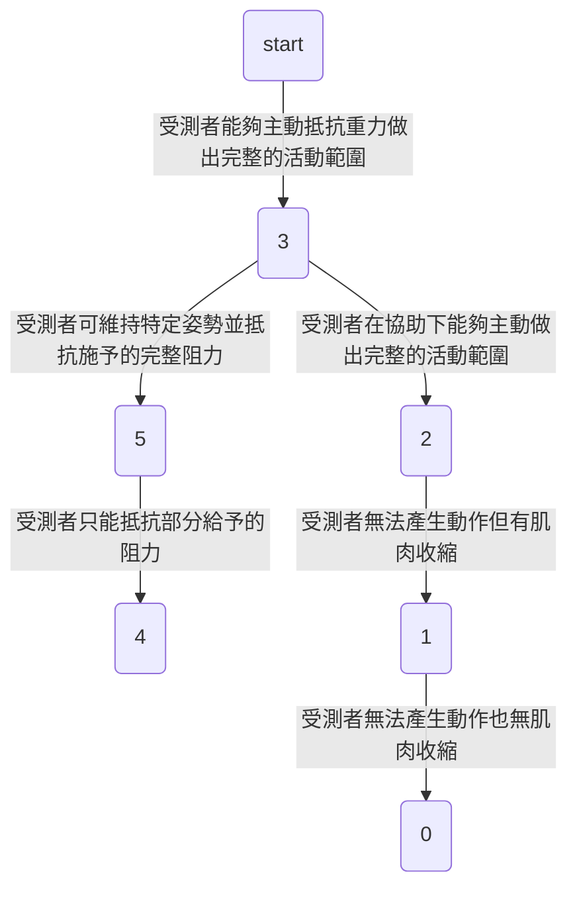

### 評分標準

```mermaid
graph TD

A(5)
B(4)
C(3)
D(2)
E(1)
F(0)
G(start)

G -->|受測者能夠主動抵抗重力做出完整的活動範圍| C
C -->|受測者可維持特定姿勢並抵抗施予的完整阻力| A
A -->|受測者只能抵抗部分給予的阻力| B
C -->|受測者在協助下能夠主動做出完整的活動範圍| D
D -->|受測者無法產生動作但有肌肉收縮| E
E -->|受測者無法產生動作也無肌肉收縮| F

```