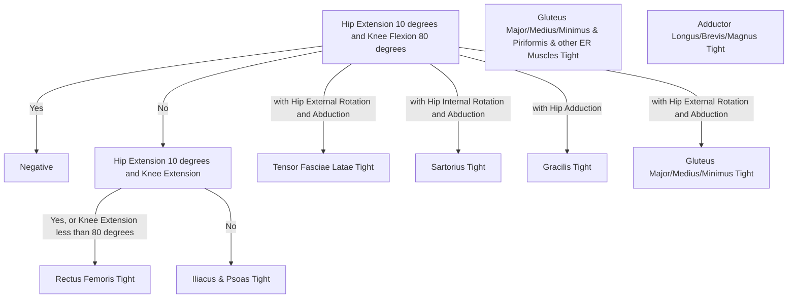

# The Hip
## Osteokinematics
動作軸軸心皆通過股骨頭
## Arthrokinematics
**Glide & Roll : Opposite Position**
* Hip Flexion : 向上滾動，向後向下滑動
* Hip Extension : 向下滾動，向前向上滑動
* Hip Abduction : 向前滾動，向下滑動
* Hip Adduction : 向下滾動，向上滑動
* Hip Internal Rotation : 向前滾動，向後滑動
* Hip External Rotation :  向後滾動，向前滑動
## Capsular Pattern
* **Internal Rotation -> Flexion/Abduction -> Extension**
* External Rotation : none
* Adduction : none
## PROM
1. Hip Flexion : 120~140 度
2. Hip Extension : 18~30度
3. Hip Abduction : 40~55度
4. Hip Adduction : 20~25度
5. Hip Internal Rotation : 30~45度
6. Hip External Rotation : 32~50度
## Landmarks of Testing
1. Greater Trochanter Femur 股骨大轉子
2. Lateral Epicondyle Femur 股骨外上髁
3. Anterior Superior iliac Spine 髂前上嵴
4. Anterior Inferior iliac Spine 髂前下嵴
5. Patella 髕骨
## Muscle Length Test
### Types
1. Thomas Test
	* Test the Length of Hip Flexor 
2. Strength Leg Raising Test (SLR)
	* Test the Length of Hamstring
3. Ober Test
	* Test the Length of 闊筋膜張肌、髂脛束 (ITB) 
4. Modified Ober Test
	* Ober Test with Knee Extension
	* Angle of Hip Adduction is bigger than Ober Test.
### Procedure
1. Thomas Test
